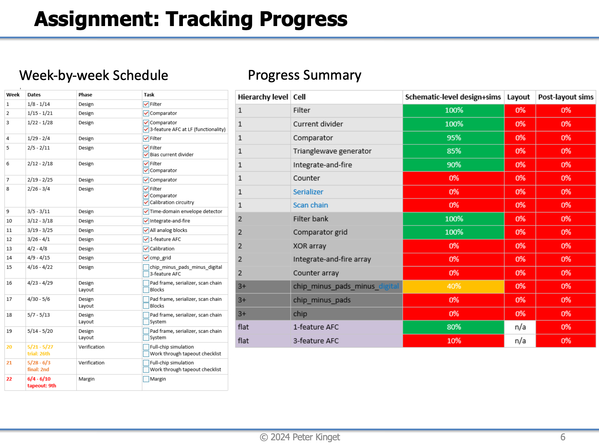

# MOSbius Track Resources

Please visit [MOSbius Chipathon 2025 Documentation GitHub Repo](https://github.com/mosbiuschip/chipathon2025) -- this will be your main goto place for finding documentation specific for the MOSbius Track.

## VLSI Design Lab Resources for MOSBius

#### General Comment made in [Element](https://matrix.to/#/!DnBsMaeQdLuqxWYMZv:fossi-chat.org/$JxHvIhSvW7KCKloXpgcvkG9U2bluJGNagxueyjykSS0?via=fossi-chat.org&via=matrix.org&via=gitter.im)

> In my feedback I have referred a couple of times to project descriptions under https://vlsidesignlab.org.

>There is now a search function for that webpage and a set of keywords that you can click to point you to projects with those functions incorporated.

>These project description pages contain a lot of circuit design, simulation, layout, and testing information that can be helpful for your designs.

>All projects also have a video presentation posted on https://www.youtube.com/@vlsidesignlabcourse

>Let me know if you have questions or suggestions to make this resource more accessible.

>(So far the keyword index covers the 2022-2024 projects, the 2014-2016 projects will be added in the coming days.)

Thanks, -- PK

## Symbols for  5V standard cells included in the gf180 PDK

> I have created symbols for some of the 5V standard cells included in the gf180 PDK so that we can create 'analog' schematics using the cells. Hopefully, we can save time by reusing the layouts of these cells for the digital circuits we need in, e.g., the switch matrix.

> I put together a [repo with my current symbols](https://github.com/peterkinget/gf180mcu_fd_sc_mcu9t5v0_symbols/tree/main), test benches, and a brief README.md — use with caution, this is work in progress.

> Let me know if you would like to collaborate on this. I can add you to the repo or you can fork and submit pull requests.

> When adding this repo into your project design repo, make sure to add it as a submodule. Your favorite GPT can probably tell you how to do that.

-- PK

## Progress Tracking Sheet

> I strongly recommend the teams to make a progress tracker that they update every week. You can use a simple google sheet to do this. See the attached example.

> Isn't not so much about getting everything estimated super accurately, it's more about syncing up the team, tracking things to do, finding bottlenecks, retargeting goals if needed, helping out others where needed etc.

> Of course, you are learning, might not know how much time certain steps will take, etc. etc. but that should not stop you from trying building a schedule, a task list, and tracking your progress. You will get better at it in your next chip designs.

An example file [here](./files/Progress_Tracker.pdf)

-- PK
